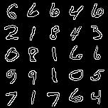
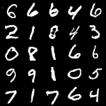
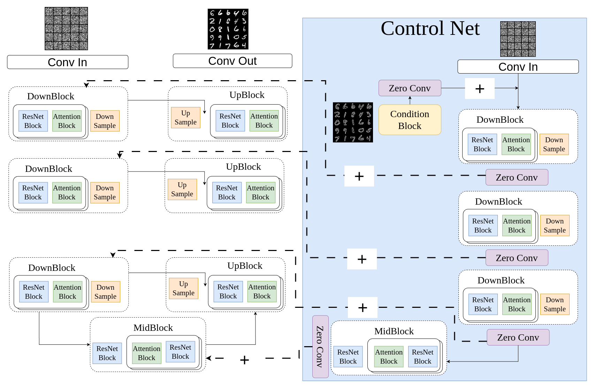

# DDPM based ControlNet Implementation in Pytorch

This is a PyTorch implementation of the ControlNet architecture for diffusion models, based on the paper "ControlNet: Adding Conditional Control to Text-to-Image Diffusion Models" by [Zhang et al.](https://arxiv.org/abs/2203.07835).

This implementation is based on [DDPM repo](https://github.com/ywu110/DDPM) implemented using PyTorch.

Due to the limitations of computational resources, this implementation is only for MNIST dataset and canny edge condition. However, it serves as a good starting point for understanding and experimenting with ControlNet.

## Sample Output produced on ControlNet on Mnist




## Network Architecture

In every sampling step, the decoder receives two things:

1. **Its usual skip‑connection feature map** coming from the locked U‑Net encoder.

2. **An extra feature map produced by the ControlNet branch at the same spatial resolution.**
    * Each ControlNet down block and the middle block ends with a $1 \times 1$ convolution whose weights and bias start at zero (“zero‑conv”).
    * The output of that zero‑conv is stored as a residual tensor. 

The network architecture is as follows:



## Dataset preparation
The dataset used in this implementation is MNIST. The dataset is downloaded from [kaggle](https://www.kaggle.com/datasets/oddrationale/mnist-in-csv/data). You can download the dataset and place it in the `data` directory. The `csv` files can be processed using the following code:

```python
import os
import cv2
import numpy as np
import _csv as csv

def extract_images(save_dir, csv_fname):
    with open(csv_fname) as f:
        reader = csv.reader(f)
        for idx, row in enumerate(reader):
            if idx == 0:
                continue
            im = np.zeros((784))
            im[:] = list(map(int, row[1:]))
            im = im.reshape((28,28))
            if not os.path.exists(os.path.join(save_dir, row[0])):
                os.mkdir(os.path.join(save_dir, row[0]))
            cv2.imwrite(os.path.join(save_dir, row[0], '{}.png'.format(idx)), im)         
```

For the canny edge condition, you don't need to do anything. The code will automatically generate the canny edge condition from the original image. The canny edge condition is generated using the following code:

```python
if self.use_condition:
    canny_image = Image.open(self.images[index])
    canny_image = np.array(canny_image)
    canny_image = cv2.Canny(canny_image, 100, 200)
    canny_image = canny_image[:, :, None]
    canny_image = np.concatenate([canny_image, canny_image, canny_image], axis=2)
    canny_image_tensor = torchvision.transforms.ToTensor()(canny_image)
    return im_tensor, canny_image_tensor
```

## Pre‑trained weights

The pre-trained weights can be found in the `mnist` directory. `mnist/ddpm_ckpt.pth` is the pre-trained weights for the DDPM model. `mnist/controlnet_ckpt.pth` is the pre-trained weights for the ControlNet model.

You can directly use the pre-trained weights to generate images by running `eval.py` file. 